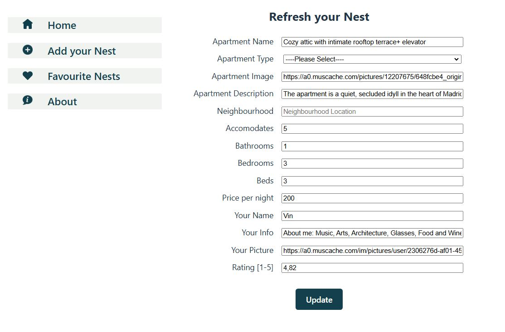

# Nest & Rest - An Apartment Rental website

## Description

The website is designed as one-stop destination for finding the perfect apartment. User can search through apartment list as well as delete or update them.

## Tech stack

Built with React JS, CSS & HTML.

## Design

The website is designed keeping the main elements in focus for easy to understand user interface.

## Features

- **Responsive Design**: The website is fully responsive, providing all features across all devices and screen sizes.
- **CRUD**: The website offers users all the CRUD operations, by listing the apartments as well as updating and deleting them.
- **Page Not Found**: Navigating to any invalid link the website will give a fun Page Not Found. 
   

## How to run the project

Click on the link to load the page in the browser.
_(https://nest-and-rest.netlify.app/)_

## How to Navigate through the website

- Landing Page: On loading the site, the user lands on the landing page. 
   
   It is built of below sections 
  - Navbar: This is fixed website header & does not change during the navigation. This holds the website Logo & the name.
  - Toolbar: This menu header is only visible on the Mobile Screens. On the other devices these menus are visible in Sidebar in Content section. The menu icon is also visible with the menu for easier visibility.
  - Content: This is again built of below sections
    - Sidebar: This menu header is not visible on the Mobile Screens. In Mobile devices these menus are visible in Toolbar section. The menu icon is also visible with the menu for easier visibility.
    - Main-Content: This section on initial load displays the Apartment List. The content of this section is changed on the menu section from Toolbar/Sidebar or while updating the listing.
  - Footer: This is fixed website footer & does not change during the navigation. This holds the gitHub Logo along with gitHub repository of the project.
- Home Menu: This menu is available in both Toolbar and Sidebar. On clicking this menu any time, the Main-content area is loaded with the Apartment Cards list.  
   
  The Apartment Card is built of below.
  - Image: A huge image of the apartment for clear view.
  - Apartment Info: Below image the apartment's title, location, rating and price are displayed. If the apartment is sold out then 'Sold out' text is displayed instead of price.
  - Edit Icon: Displayed on top right corner of the Card. On clicking this button the respective apartment is loaded in Edit mode for update. 
     
  - Delete Icon: Displayed on top right corner of the Card. On clicking this button the respective apartment is deleted from the list.
  - Apartment Details: Clicking on the Card loads the Main-content section with the Apartment Details.  
     
    The Apartment Details is built of below.
    - Image: A huge image of the apartment for clear view.
    - Apartment Info: Parallel to the image, the apartment's title, location, guest count, accomation details, description, rating, host picture-name-info and price are displayed. If the apartment is sold out then 'Sold out' text is displayed instead of price.
- Add your Nest: This menu is available in both Toolbar and Sidebar. On clicking this menu any time, the Main-content area is loaded with a Form for new apartment entry. 
   
- About Menu: This menu is available in both Toolbar and Sidebar. This page provides details about the website and the designers. 

## Mobile Version

- Fully responsive with Toobar with easy menu access. 
   

## Local Deployment and Run Instructions

- Git Clone the project with 'git clone https://github.com/nehais/apartment-rental.git'.
- Install the libraries with 'npm install'.
- Run the project locally with 'npm run dev'.
